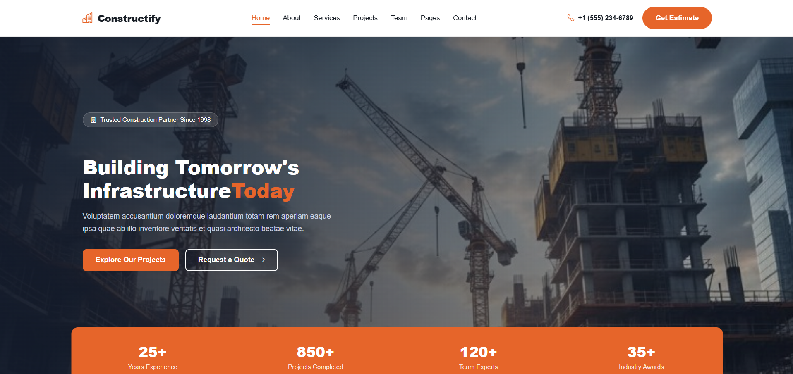
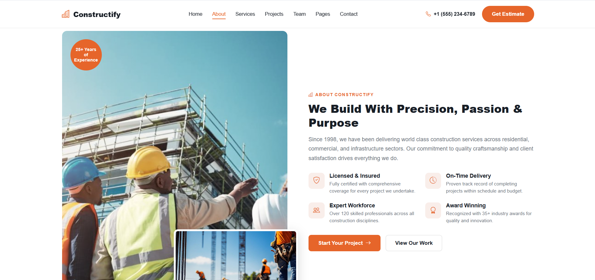
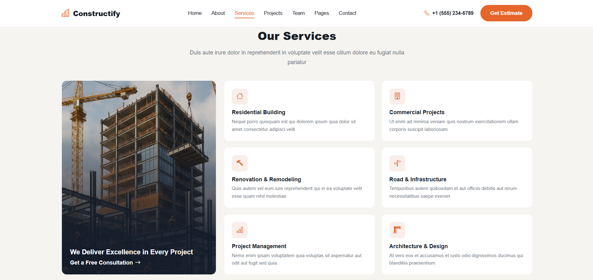
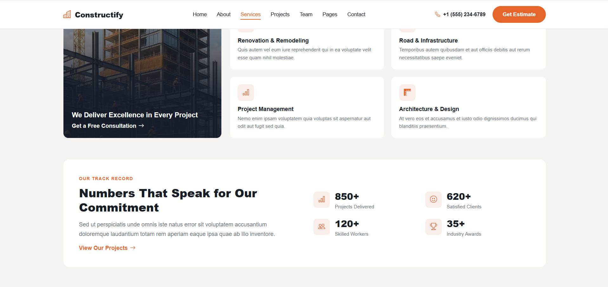
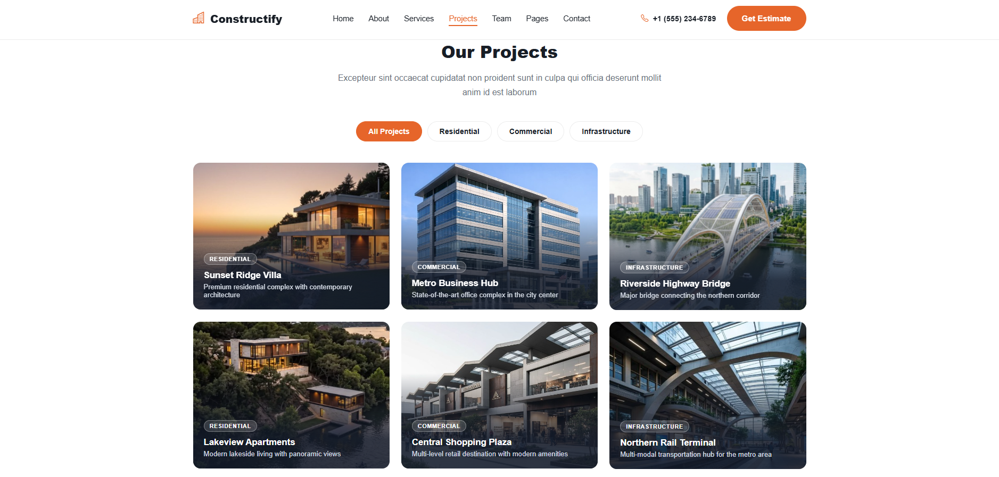
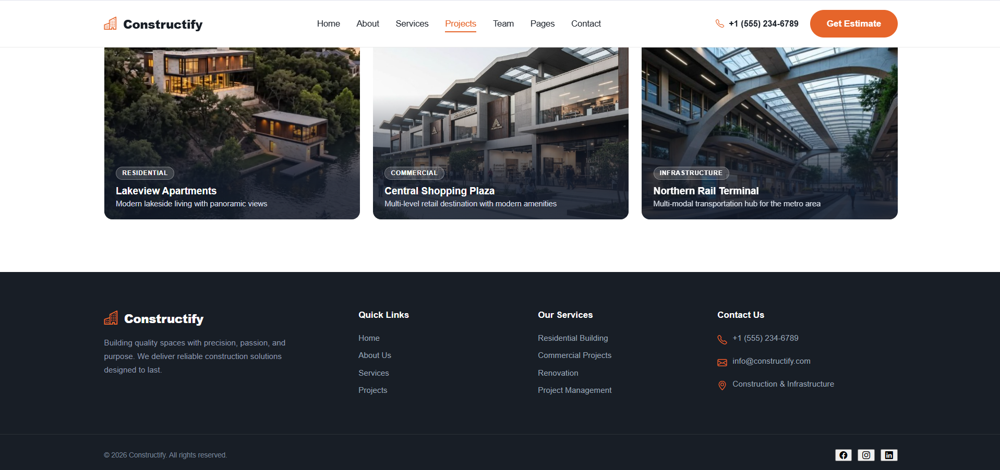

Each section of the page has its own endpoint and its own tables, so
it's easy to trace where any piece of content actually comes from:

| React API call     | PHP endpoint         | Database tables                              |
|---------------------|-----------------------|-----------------------------------------------|
| `getSiteSettings()` | `site-settings.php`   | `site_settings`                                |
| `getHero()`          | `hero.php`             | `hero_section` + `counters`                    |
| `getAbout()`         | `about.php`            | `about_section` + `about_features`             |
| `getServices()`      | `services.php`         | `services_section` + `services` + `counters`   |
| `getProjects()`      | `projects.php`         | `projects_section` + `project_categories` + `projects` |

## Database structure

- **`hero_section`** — the Home/Hero content: badge, title, subtitle, CTA buttons, background image.
- **`about_section`** + **`about_features`** — the main About copy, plus its repeatable feature cards.
- **`services_section`** + **`services`** — the section heading and panel/track-record text, plus each individual service card.
- **`projects_section`** + **`project_categories`** + **`projects`** — the Projects heading, the filter categories, and the actual project entries.
- **`counters`** — one reusable table for stat blocks, shared by both Hero and Services (they're told apart by `section_key`).

## Screenshots

| Home | About |
|---|---|
|  |  |

| Services | Services |
|---|---|
|  |  |

| Projects | Projects |
|---|---|
|  |  |

## Project structure