# Constructify — Construction Portfolio

A full-stack construction company portfolio website with a React client, React Admin Panel, native PHP API, and MySQL database.

The website content is managed dynamically through the database, so administrators can update the portfolio without modifying the frontend code.

## How it's wired together

```text
React Client
      ↓
PHP Native API
      ↓
MySQL Database
      ↑
React Admin Panel
```

Main Sections:

- **Hero** — Main landing section, content, image, CTA buttons, and counters.
- **About** — Company information, images, and feature cards.
- **Services** — Services section, service items, and track-record counters.
- **Projects** — Projects, categories, images, and project information.
- **Site Settings** — General website settings, navbar, and footer information.

## Database structure

- **`site_settings`** — Navbar and footer information, plus general website settings.
- **`hero_section`** — Home/Hero content: badge, title, subtitle, CTA buttons, and background image.
- **`about_section`** + **`about_features`** — Main About copy, images, and repeatable feature cards.
- **`services_section`** + **`services`** — Section heading, panel and track-record text, plus individual service cards.
- **`projects_section`** + **`project_categories`** + **`projects`** — Projects heading, filter categories, and project entries.
- **`counters`** — Reusable statistic blocks shared by Hero and Services, separated using `section_key`.
- **`admins`** — Administrator accounts used for Admin Panel authentication.

## Screenshots

### Home


### About


### Services


### Projects
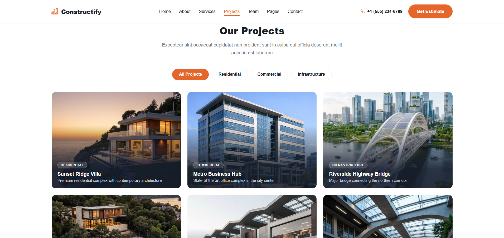


### Admin Dashboard
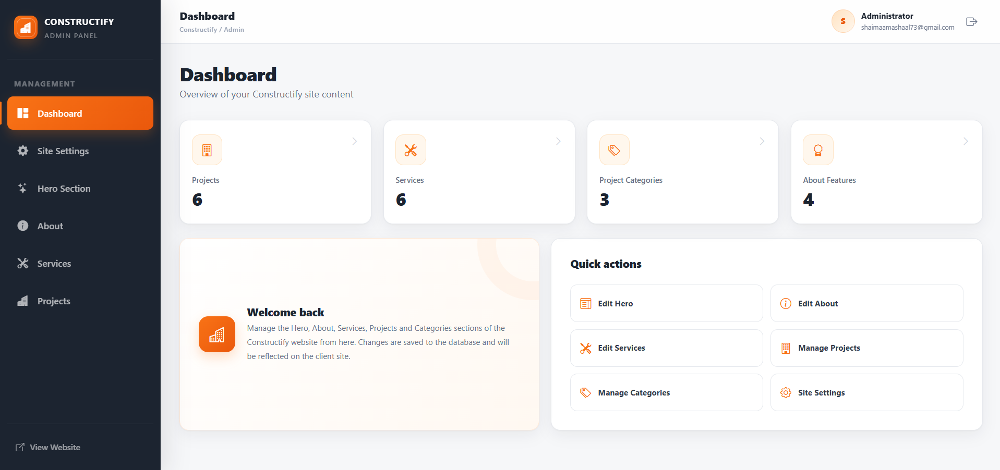

### Admin Hero
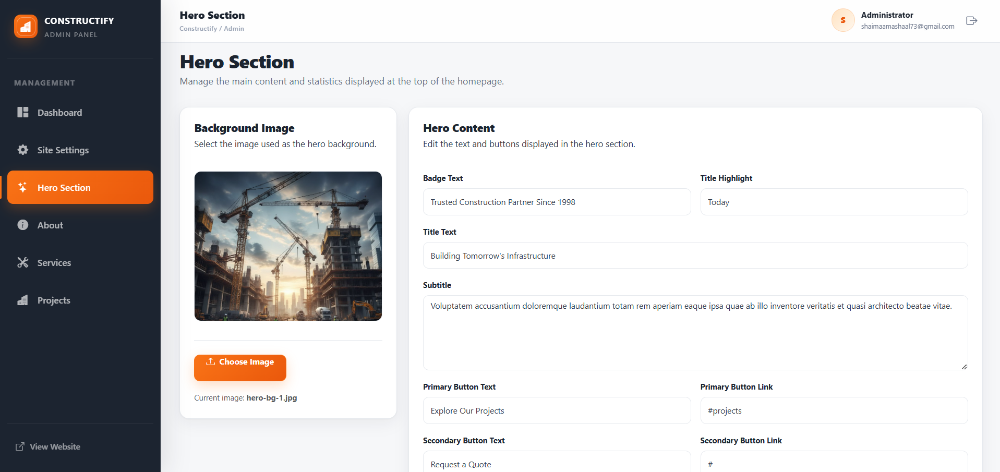

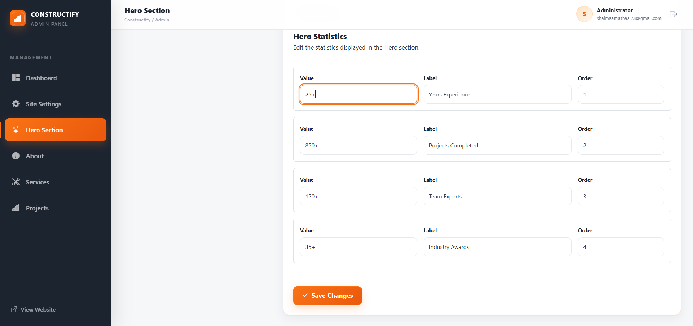

### Admin About
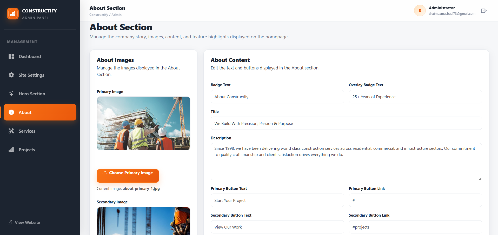

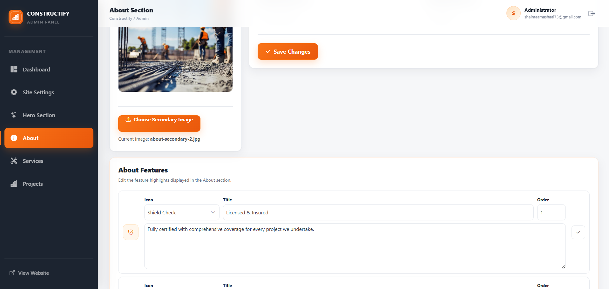

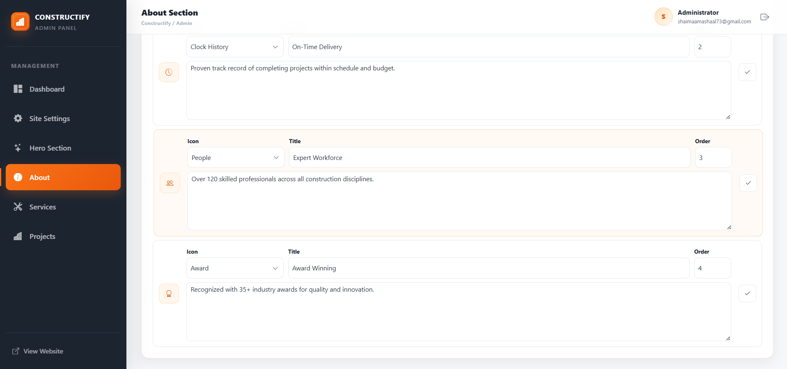

### Admin Services
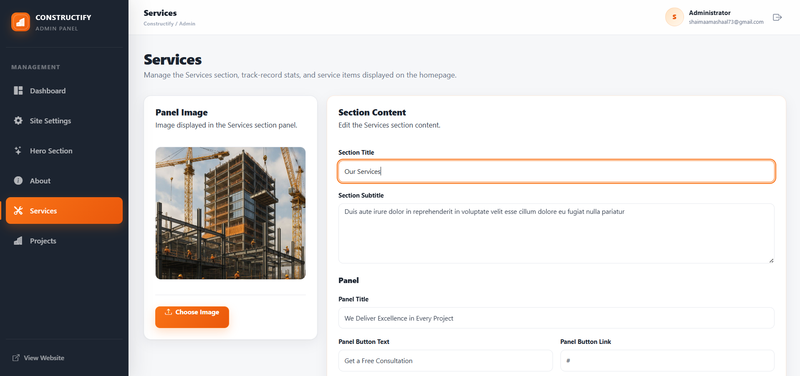

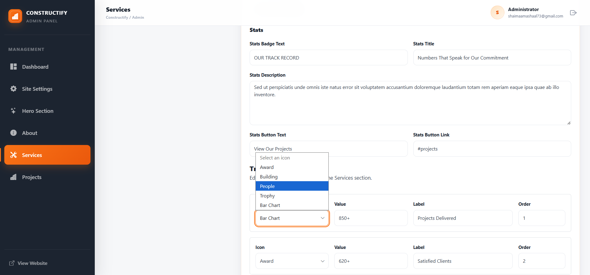

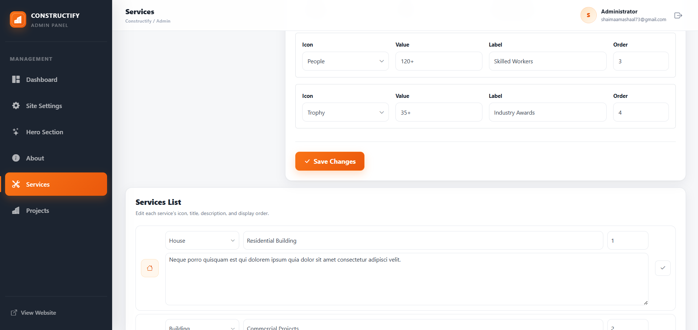

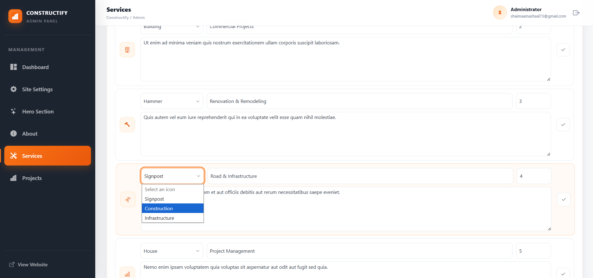

### Admin Projects
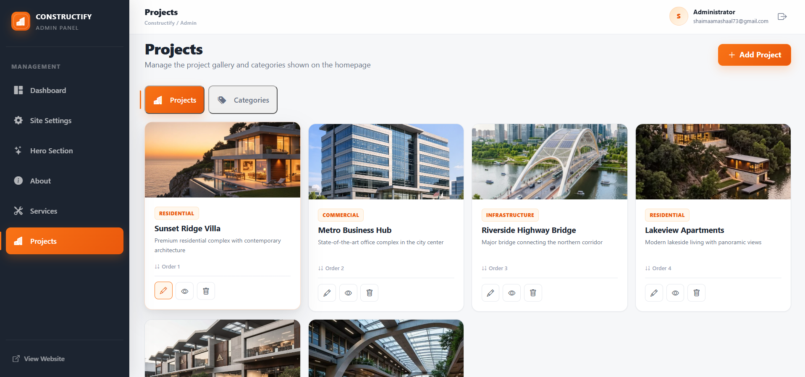

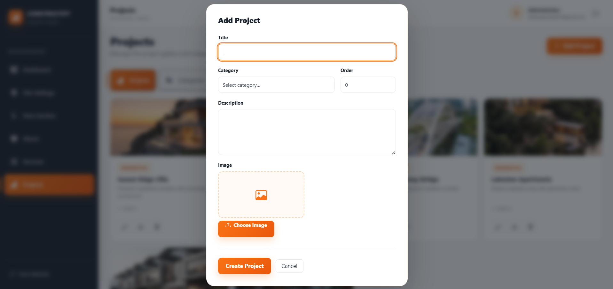

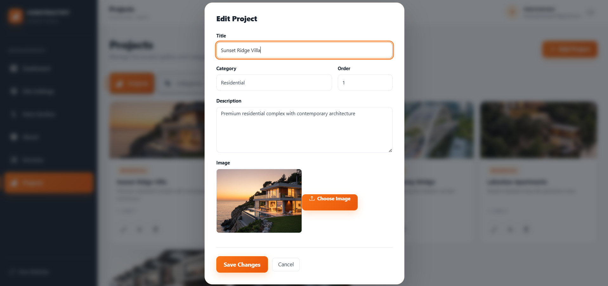

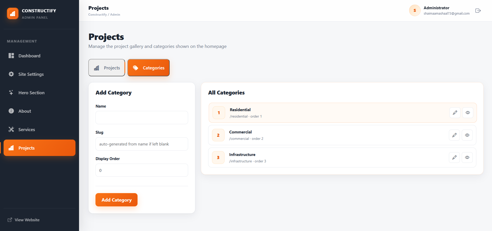

### Admin Site Settings
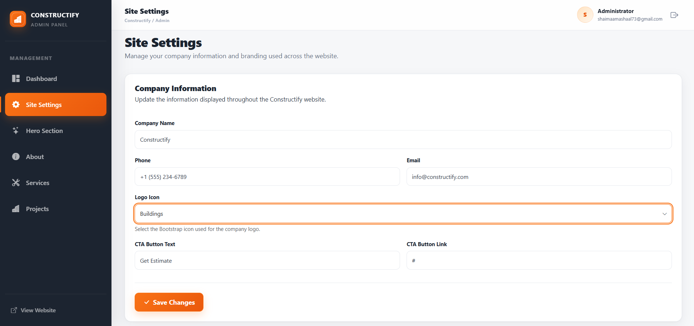

## Getting it running

**1. Database**

Import `database/schema.sql` into MySQL, then update the credentials in:

```text
backend/includes/db.php
```

to match your local setup.

**2. Backend**

Serve the `backend/` folder with PHP. XAMPP, WAMP, or PHP’s built-in server all work.

```bash
php -S localhost:8000
```

Each file inside `backend/api/` returns JSON content for a website section.

The Admin API is available at:

```text
http://localhost/construction-portfolio/Server/api/admin
```

**3. Frontend**

```bash
cd Client
npm install
npm start
```

The Client application normally runs at:

```text
http://localhost:3000
```

Add the Bootstrap Icons link inside `Client/public/index.html`:

```html
<!-- Bootstrap Icons -->
<link
  rel="stylesheet"
  href="https://cdn.jsdelivr.net/npm/bootstrap-icons@1.11.3/font/bootstrap-icons.min.css"
/>
```

Copy `.env.example` to `.env`, then set the API URL:

```env
REACT_APP_API_URL=http://localhost/construction-portfolio/Server/api
```

**4. Admin Panel**

```bash
cd Admin
npm install
npm start
```

The Admin Panel runs at:

```text
http://localhost:3001
```

Create an `.env` file inside the `Admin` folder:

```env
REACT_APP_API_URL=http://localhost/construction-portfolio/Server/api
REACT_APP_ADMIN_API_URL=http://localhost/construction-portfolio/Server/api/admin
```

## A few things worth knowing

- Website content is stored in MySQL and loaded dynamically through the PHP API.
- The Client and Admin Panel are separate React applications connected to the same backend.
- Images uploaded through the Admin Panel are stored in the `uploads/` directory.
- Image filenames in the database must match the actual files in the images or uploads directory.
- Admin routes require JWT authentication.
- Project categories and projects support full CRUD operations.
- `Team`, `Pages`, and `Contact` in the navigation are placeholders for now.

## Admin Panel

The Admin Panel allows authenticated administrators to manage website content through a dashboard.

Administrators can:

- Update Hero content and counters.
- Update About content and features.
- Update Services section content and service items.
- Update Services counters.
- Create and update project categories.
- Create, update, and delete projects.
- Update site settings.
- Upload and replace website images.

## Technologies

- React.js
- JavaScript
- PHP
- MySQL
- JWT Authentication
- Bootstrap Icons
- XAMPP / WAMP
- phpMyAdmin
